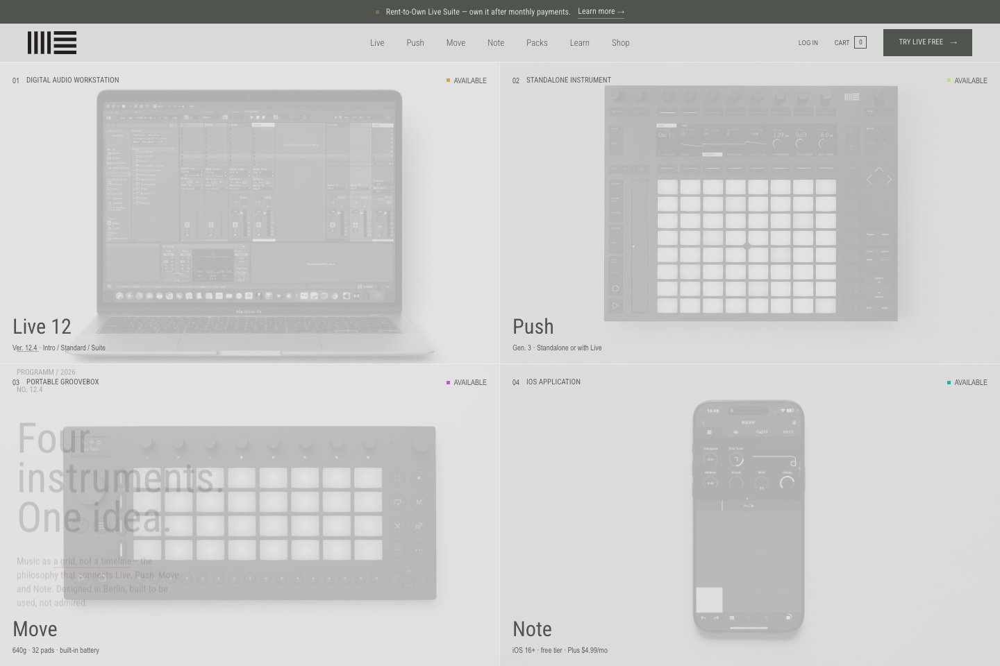
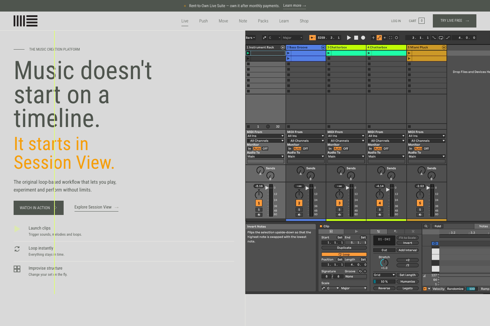
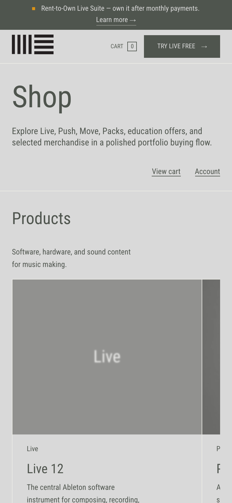
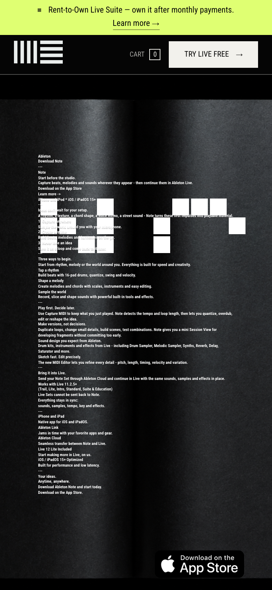

# Ableton Programme

A UX/UI design case study implemented directly in frontend code.

This project is an independent redesign concept for Ableton's product ecosystem. It is not affiliated with, endorsed by, or connected to Ableton AG.

## Live Demo

[https://ableton-r.vercel.app](https://ableton-r.vercel.app)

## Overview

Ableton Programme explores how Ableton's software, hardware, learning, content, and shop surfaces could be structured as one coherent digital product archive.

The project represents a designer working through frontend development. The design decisions are not handed off from a mockup into a separate build phase; they are defined and refined directly in the interface: structure, user experience, navigation logic, visual hierarchy, spacing, rhythm, interaction states, and product feel.

This is not about replacing design work with code for efficiency. It is about using frontend implementation as a more direct design medium. The goal is to reach the final interface more organically and precisely, with the visual, UX, and technical decisions shaping each other in the same working process.

The result is a multi-page portfolio piece with product pages for Live, Push, Move, Note, Packs, shop flows, account-style screens, cart interactions, and responsive mobile patterns.

## Design Framing

**Problem:** Ableton has a broad product ecosystem. A redesign concept needs to communicate that range without flattening it into a single landing page or a purely decorative visual treatment.

**Approach:** Treat the site as a product catalogue and interaction system. Build clear routes, strong typographic structure, deliberate spacing, mobile-specific navigation, and page-level identities while keeping the overall language restrained and usable.

**Outcome:** A coded case study that lets the design be experienced directly: users can move through products, inspect details, open packs, interact with shop/account surfaces, and test the responsive behavior in a real browser.

## Role

This project reflects the way I work: as a designer who builds frontend interfaces.

My background and judgement are rooted in design: interface structure, user experience, visual hierarchy, proportion, spacing, rhythm, and product feel. I use frontend development to implement that judgement directly in the final medium, whether the output is a website, browser-based product, application interface, or interactive prototype.

I am positioning this work for frontend roles where design judgement matters: roles that need someone who can make product and interface decisions, then build them with care instead of only passing them across a handoff.

That means the work is not split into separate designer-to-developer stages. The same person defining the aesthetic direction, interaction logic, and user flow is also shaping the rendered product in code.

In this project, that includes:

- defining the information architecture and page relationships
- shaping user journeys across product, shop, and account surfaces
- designing layout systems, spacing, rhythm, and visual hierarchy
- setting interaction behavior for navigation, product previews, cart states, and mobile menus
- translating the design directly into production-style frontend code
- keeping implementation decisions accountable to the intended product experience

The code exists in service of the design, but the implementation is also part of the design process. It is not presented as a generic frontend demo, and it is not only a static UI concept.

## Screenshots

| Desktop Home | Desktop Live |
| --- | --- |
|  |  |

| Mobile Shop | Mobile Note |
| --- | --- |
|  |  |

## Implementation

The case study is implemented as a Next.js application so the design can be evaluated as an actual interface, not only as presentation images. The implementation demonstrates frontend capability, but the emphasis is on how code is used to express and test design decisions in the product itself.

- Next.js 16 App Router
- React 19
- TypeScript
- Route-level metadata and static generation
- Feature-scoped CSS design system
- Data-driven products and packs
- Local/demo cart and account flows
- Vitest and React Testing Library
- Playwright smoke/audit coverage
- Vercel deployment

## Project Structure

```txt
src/app/        App Router routes, metadata, static params, server wrappers
src/features/   Larger feature modules with local UI and state helpers
src/views/      Page-level visual compositions
src/components/ Shared layout, section, icon, and utility components
src/contexts/   Client-side cart and preview state
src/data/       Product, pack, footer, and navigation data
src/lib/        Framework adapters and business utilities
src/styles/     Feature-scoped CSS files imported by src/styles.css
src/test/       Vitest setup and framework mocks
e2e/            Playwright coverage for key routes and user flows
```

More detail: [docs/ARCHITECTURE.md](docs/ARCHITECTURE.md)

## Running Locally

```bash
npm install
npm run dev
```

Open [http://localhost:3000](http://localhost:3000).

## Quality Checks

```bash
npm run typecheck
npm run lint
npm run test
npm run build
```

## Known Limitations

- This is a personal portfolio concept, not an official Ableton product or commerce system.
- Checkout and account flows are local/demo flows; they do not process real payments or authenticate against a backend.
- Some content and assets are static portfolio materials rather than CMS-managed production content.
- The project prioritizes communicating design direction and interface behavior over recreating a complete commercial platform.
- `next/image` migration is a future optimization pass; the current build preserves custom image behavior with standard image elements.

## Repository Notes

Internal design decisions and session notes live under `project-governance/`. They document design direction, implementation decisions, and review context for the project.
